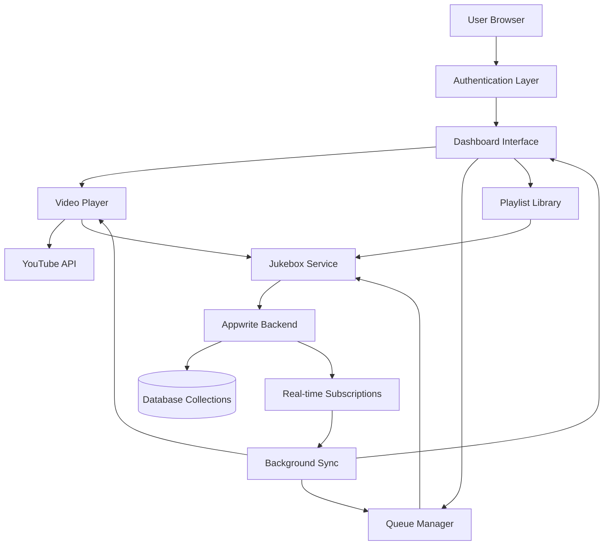

# DJAMMS Data Flow Documentation

## Table of Contents
- [System Overview](#system-overview)
- [Authentication Flow](#authentication-flow)
- [Video Playback Flow](#video-playback-flow)
- [Queue Management Flow](#queue-management-flow)
- [Real-time Synchronization](#real-time-synchronization)
- [Multi-Window Communication](#multi-window-communication)
- [Database Operations](#database-operations)

## System Overview



## Authentication Flow

```
┌─────────────┐    ┌──────────────┐    ┌─────────────┐    ┌──────────────┐
│   Browser   │    │  SvelteKit   │    │  Appwrite   │    │   Google     │
│             │    │   Client     │    │   Server    │    │    OAuth     │
└──────┬──────┘    └──────┬───────┘    └──────┬──────┘    └──────┬───────┘
       │                  │                   │                  │
       │ 1. Click Login   │                   │                  │
       ├─────────────────►│                   │                  │
       │                  │ 2. Redirect to    │                  │
       │                  │    Google OAuth   │                  │
       │                  ├──────────────────────────────────────►│
       │                  │                   │                  │
       │ 3. User Consent  │                   │                  │
       │◄─────────────────────────────────────────────────────────┤
       │                  │                   │                  │
       │ 4. Auth Code     │                   │                  │
       ├─────────────────►│ 5. Exchange Code  │                  │
       │                  ├──────────────────►│ 6. Validate Code │
       │                  │                   ├─────────────────►│
       │                  │ 7. Session Token  │ 8. User Info     │
       │ 9. Redirect to   │◄──────────────────┤◄─────────────────┤
       │    Dashboard     │                   │                  │
       │◄─────────────────┤                   │                  │
```

### Authentication Process Details:
1. User clicks "Connect with Google" button
2. SvelteKit redirects to Google OAuth authorization URL
3. User grants permissions on Google's consent screen
4. Google redirects back with authorization code
5. SvelteKit exchanges code for access token via Appwrite
6. Appwrite validates token with Google
7. Appwrite returns session token to client
8. Google returns user profile information
9. User is redirected to dashboard with active session

## Video Playback Flow

```
┌─────────────┐    ┌──────────────┐    ┌─────────────┐    ┌──────────────┐
│ User Action │    │   Player     │    │  Jukebox    │    │   YouTube    │
│             │    │  Component   │    │  Service    │    │     API      │
└──────┬──────┘    └──────┬───────┘    └──────┬──────┘    └──────┬───────┘
       │                  │                   │                  │
       │ 1. Click Play    │                   │                  │
       ├─────────────────►│                   │                  │
       │                  │ 2. Get Next Song  │                  │
       │                  ├──────────────────►│                  │
       │                  │ 3. Song Data      │                  │
       │                  │◄──────────────────┤                  │
       │                  │ 4. Load Video     │                  │
       │                  ├──────────────────────────────────────►│
       │                  │                   │ 5. Update State  │
       │                  │                   │ (loading)        │
       │                  │◄──────────────────┤                  │
       │                  │ 6. Video Ready    │                  │
       │                  │◄──────────────────────────────────────┤
       │                  │ 7. Update State   │                  │
       │                  ├──────────────────►│ (playing)        │
       │                  │                   │                  │
       │                  │ 8. Video Ended    │                  │
       │                  │◄──────────────────────────────────────┤
       │                  │ 9. Progress Queue │                  │
       │                  ├──────────────────►│                  │
       │                  │ 10. Next Song     │                  │
       │                  │◄──────────────────┤                  │
```

### Video Playback States:
- **ready**: Player initialized, no video loaded
- **loading**: Video being fetched from YouTube
- **playing**: Video actively playing
- **paused**: Video paused by user
- **ended**: Video completed, ready for next
- **error**: Playback error occurred
- **blocked**: Content blocked (copyright, region, etc.)

## Queue Management Flow

```
┌─────────────┐    ┌──────────────┐    ┌─────────────┐    ┌──────────────┐
│    User     │    │    Queue     │    │  Priority   │    │  Background  │
│ Interface   │    │   Manager    │    │   Queue     │    │ Queue Manager│
└──────┬──────┘    └──────┬───────┘    └──────┬──────┘    └──────┬───────┘
       │                  │                   │                  │
       │ 1. Add Song      │                   │                  │
       ├─────────────────►│                   │                  │
       │                  │ 2. Create Item    │                  │
       │                  ├──────────────────►│                  │
       │                  │ 3. Item Added     │                  │
       │                  │◄──────────────────┤                  │
       │                  │                   │ 4. Queue Change  │
       │                  │                   │ Event            │
       │                  │                   ├─────────────────►│
       │                  │                   │                  │
       │                  │                   │ 5. Auto Progress │
       │                  │                   │ (on video end)   │
       │                  │◄──────────────────────────────────────┤
       │                  │ 6. Remove Played  │                  │
       │                  ├──────────────────►│                  │
       │                  │ 7. Get Next       │                  │
       │                  ├──────────────────►│                  │
       │                  │ 8. Next Song Data │                  │
       │                  │◄──────────────────┤                  │
```

### Queue Priority System:
- **Priority 1-10**: User requests (lower number = higher priority)
- **Priority 11+**: Auto-queued songs from playlist
- **FIFO within priority**: Same priority items play in order added
- **Dynamic reordering**: Users can move items up/down in queue

## Real-time Synchronization

```
┌─────────────┐    ┌──────────────┐    ┌─────────────┐    ┌──────────────┐
│  Window A   │    │   Appwrite   │    │  Window B   │    │  Window C    │
│  (Player)   │    │  Real-time   │    │ (Dashboard) │    │  (Queue)     │
└──────┬──────┘    └──────┬───────┘    └──────┬──────┘    └──────┬───────┘
       │                  │                   │                  │
       │ 1. State Change  │                   │                  │
       ├─────────────────►│                   │                  │
       │                  │ 2. Broadcast      │                  │
       │                  ├──────────────────►│                  │
       │                  │                   │ 3. Update UI     │
       │                  │                   ├─────────────────►│
       │                  │                   │                  │
       │                  │ 4. Broadcast      │                  │
       │                  ├─────────────────────────────────────►│
       │                  │                   │                  │ 5. Update UI
       │                  │                   │                  ├──────────┐
       │                  │                   │                  │          │
       │                  │                   │                  │◄─────────┘
```

### Real-time Events:
- **jukebox_state.update**: Player status, current track, position
- **priority_queue.create**: New song added to queue
- **priority_queue.delete**: Song removed from queue
- **priority_queue.update**: Queue item priority changed
- **instance_states.update**: Multi-window player synchronization

## Multi-Window Communication

```
Browser Window Architecture:

┌─────────────────────────────────────────────────────────────┐
│                      Browser                                │
│  ┌─────────────┐  ┌─────────────┐  ┌─────────────┐         │
│  │  Dashboard  │  │Video Player │  │Queue Manager│         │
│  │   Window    │  │   Window    │  │   Window    │         │
│  │             │  │             │  │             │         │
│  │ Instance:   │  │ Instance:   │  │ Instance:   │         │
│  │ dash-123    │  │ player-456  │  │ queue-789   │         │
│  └─────┬───────┘  └─────┬───────┘  └─────┬───────┘         │
│        │                │                │                 │
│        └────────────────┼────────────────┘                 │
│                         │                                  │
└─────────────────────────┼──────────────────────────────────┘
                          │
                    ┌─────▼─────┐
                    │ Appwrite  │
                    │Real-time  │
                    │   Hub     │
                    └───────────┘
```

### Instance Management:
1. Each window generates unique instance ID
2. Instance ID format: `{type}-{timestamp}-{random}`
3. All instances subscribe to same jukebox state
4. Changes in one window propagate to all others
5. Active player window takes control precedence

## Database Operations

```
┌─────────────┐    ┌──────────────┐    ┌─────────────┐
│   Client    │    │   Service    │    │  Appwrite   │
│  Request    │    │    Layer     │    │  Database   │
└──────┬──────┘    └──────┬───────┘    └──────┬──────┘
       │                  │                   │
       │ 1. Action        │                   │
       ├─────────────────►│                   │
       │                  │ 2. Validate       │
       │                  ├──────────┐        │
       │                  │          │        │
       │                  │◄─────────┘        │
       │                  │ 3. Database Op    │
       │                  ├──────────────────►│
       │                  │ 4. Response       │
       │                  │◄──────────────────┤
       │                  │ 5. Update State   │
       │                  ├──────────┐        │
       │                  │          │        │
       │                  │◄─────────┘        │
       │ 6. UI Update     │                   │
       │◄─────────────────┤                   │
```

### Database Collections Flow:

#### Jukebox State Collection:
```
CREATE/UPDATE → Validation → Database Write → Real-time Broadcast → UI Update
```

#### Priority Queue Collection:
```
ADD SONG → Generate Priority → Insert Document → Trigger Background Manager
REMOVE SONG → Delete Document → Update Queue Display
REORDER → Update Priority Values → Broadcast Changes
```

#### Memory Playlist Collection:
```
LOAD PLAYLIST → Query Active Songs → Shuffle Order → Cache in Memory
GET NEXT → Query Least Recently Played → Update Statistics → Return Song
UPDATE STATS → Increment Play Count → Set Last Played Timestamp
```

#### Instance States Collection:
```
PLAYER START → Create Instance Document → Subscribe to Changes
STATUS CHANGE → Update Instance State → Sync Across Windows
PLAYER CLOSE → Delete Instance Document → Cleanup Subscriptions
```

## Error Handling Flow

```
┌─────────────┐    ┌──────────────┐    ┌─────────────┐    ┌──────────────┐
│   Action    │    │ Error Check  │    │   Recovery   │    │     UI       │
│  Trigger    │    │  & Logging   │    │   Strategy   │    │  Feedback    │
└──────┬──────┘    └──────┬───────┘    └──────┬──────┘    └──────┬───────┘
       │                  │                   │                  │
       │ 1. Operation     │                   │                  │
       ├─────────────────►│                   │                  │
       │                  │ 2. Error Occurs  │                  │
       │                  ├─────────┐         │                  │
       │                  │         │         │                  │
       │                  │◄────────┘         │                  │
       │                  │ 3. Determine      │                  │
       │                  │    Recovery       │                  │
       │                  ├──────────────────►│                  │
       │                  │                   │ 4. Execute Fix   │
       │                  │                   ├─────────┐        │
       │                  │                   │         │        │
       │                  │                   │◄────────┘        │
       │                  │                   │ 5. User Notice   │
       │                  │                   ├─────────────────►│
       │                  │                   │                  │ 6. Display
       │                  │                   │                  ├──────────┐
       │                  │                   │                  │          │
       │                  │                   │                  │◄─────────┘
```

### Error Recovery Strategies:
- **Network Errors**: Retry with exponential backoff
- **Authentication Errors**: Redirect to login
- **Video Playback Errors**: Skip to next song
- **Database Conflicts**: Merge state and retry
- **Real-time Disconnections**: Reconnect automatically