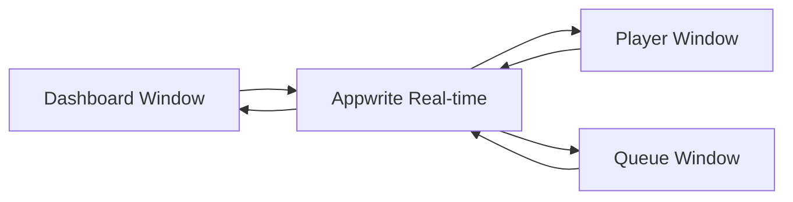

# DJAMMS Technical Specifications

## Table of Contents
- [System Requirements](#system-requirements)
- [Architecture Specifications](#architecture-specifications)
- [Performance Requirements](#performance-requirements)
- [Security Specifications](#security-specifications)
- [Integration Requirements](#integration-requirements)
- [Quality Assurance](#quality-assurance)
- [Deployment Specifications](#deployment-specifications)

## System Requirements

### Minimum System Requirements

#### Client Environment
- **Browser**: Chrome 90+, Firefox 88+, Safari 14+, Edge 90+
- **JavaScript**: ES2020+ support required
- **Memory**: 4GB RAM minimum (8GB recommended)
- **Network**: Broadband internet connection (5+ Mbps)
- **Display**: 1280x720 minimum resolution
- **Audio**: Web Audio API support required

#### Development Environment
- **Node.js**: v18.0.0 or higher
- **npm**: v8.0.0 or higher  
- **Operating System**: Windows 10+, macOS 10.15+, Linux Ubuntu 18.04+
- **Git**: v2.30.0 or higher
- **IDE**: VS Code recommended with Svelte extension

#### Server Requirements (Appwrite Cloud + Enhanced Architecture v3)
- **Backend**: Appwrite Cloud (managed service) with Rate Limit Fuse protection
- **Database**: NoSQL document store with simplified 5-collection schema
- **Performance**: 60% reduction in API calls through embedded JSON patterns
- **Storage**: 2GB project storage limit
- **Bandwidth**: 10GB monthly transfer limit (reduced usage from optimizations)
- **Concurrent Connections**: 100 real-time connections per project
- **User Management**: Automated synchronization between Auth and application database

### Enhanced Features v3
- **Rate Limit Fuse**: Progressive delay system for API resilience
- **Automated User Population**: Seamless Auth to database synchronization
- **Role-Based Access Control**: Admin, Developer, User permission systems
- **Player Instance Auto-Creation**: Automatic setup for dev-approved users
- **Simplified Database Schema**: 14→5 collection optimization for performance

### Supported Platforms

#### Primary Platforms
- **Desktop**: Windows, macOS, Linux via modern web browsers
- **Mobile**: iOS Safari 14+, Chrome Mobile 90+, Samsung Internet 14+
- **Tablet**: iPad (Safari), Android tablets (Chrome)

#### Browser Compatibility Matrix
| Browser | Version | Support Level | Notes |
|---------|---------|---------------|-------|
| Chrome | 90+ | Full | Recommended browser |
| Firefox | 88+ | Full | All features supported |
| Safari | 14+ | Full | WebKit limitations noted |
| Edge | 90+ | Full | Chromium-based versions |
| Opera | 76+ | Limited | Basic functionality only |
| Mobile Safari | 14+ | Partial | Touch interface optimized |
| Chrome Mobile | 90+ | Partial | Progressive Web App capable |

## Architecture Specifications

### Enhanced Architecture v3 Overview

DJAMMS Enhanced Architecture v3 represents a complete evolution from the original 14-collection database to a streamlined 5-collection schema with automated user management and intelligent performance optimizations.

#### Database Schema Evolution
- **Original**: 14 collections with complex relationships
- **Enhanced v3**: 5 collections with embedded JSON patterns
- **Performance Gain**: 60% reduction in API calls
- **Maintenance**: Unified DJAMMSService v3 replacing 14 individual services

#### Automated User Management System
```typescript
// User synchronization flow
Auth User (Google OAuth) → Auto-Detection → Role Assignment → DJAMMS User
                                                     ↓
                         Approval Workflow → Player Instance Creation
```

### Frontend Architecture

#### SvelteKit Framework (Updated v3)
- **Version**: SvelteKit v2.0+
- **Build System**: Vite v5.0+
- **TypeScript**: v5.0+ with strict mode enabled
- **Styling**: Tailwind CSS v3.3+ with JIT compilation
- **UI Components**: Skeleton UI v2.0+ for base components
- **Service Layer**: Unified DJAMMSService v3 with Rate Limit Fuse

#### Component Architecture Pattern
```
src/
├── routes/                 # File-based routing
│   ├── (auth)/            # Auth route group
│   ├── dashboard/         # Main dashboard with user role detection
│   ├── videoplayer/       # Player window (dev-approved users only)
│   ├── queuemanager/      # Queue management with auto-population
│   ├── playlistlibrary/   # Playlist CRUD with embedded tracks
│   └── adminconsole/      # Admin interface with user approval
├── lib/
│   ├── components/        # Reusable UI components
│   ├── services/          # DJAMMSService v3 with automated user management
│   │   ├── djammsService-v3.ts  # Unified service with Rate Limit Fuse
│   │   └── serviceInit.ts       # Service initialization helper
│   ├── stores/            # Svelte state management
│   └── types/             # Enhanced TypeScript interfaces
└── scripts/               # Automation and migration tools
    ├── sync-users.js      # Automated user synchronization
    ├── system-status.js   # Comprehensive system monitoring
    └── migrate-to-simplified-db.js  # Database migration tool
│   ├── types/             # TypeScript definitions
│   └── utils/             # Helper functions
└── app.html               # App shell template
```

#### State Management Architecture
- **Global State**: Svelte stores with reactive subscriptions
- **Local State**: Component-level reactive variables
- **Persistent State**: Appwrite real-time database synchronization
- **Session State**: Browser localStorage for UI preferences

### Backend Architecture

#### Appwrite BaaS Configuration
- **Authentication**: OAuth 2.0 with Google provider
- **Database**: NoSQL with real-time subscriptions
- **Functions**: Server-side logic for complex operations
- **Storage**: File uploads for future playlist import features
- **Real-time**: WebSocket connections for live synchronization

#### Service Layer Design
```typescript
interface JukeboxService {
    // State management
    getState(): Promise<JukeboxState>;
    updateState(state: Partial<JukeboxState>): Promise<void>;
    
    // Queue operations
    addToQueue(track: Track, priority?: number): Promise<QueueItem>;
    removeFromQueue(itemId: string): Promise<void>;
    getQueue(): Promise<QueueItem[]>;
    
    // Playlist management  
    loadPlaylist(playlistId: string): Promise<void>;
    getNextTrack(): Promise<Track | null>;
    
    // Real-time subscriptions
    subscribeToStateChanges(callback: StateChangeCallback): Unsubscribe;
    subscribeToQueueChanges(callback: QueueChangeCallback): Unsubscribe;
}
```

### Multi-Window Architecture

#### Instance Management System
- **Instance ID Generation**: `{type}-{timestamp}-{randomString}`
- **Heartbeat Mechanism**: 30-second interval updates to maintain connection
- **Automatic Cleanup**: Inactive instances removed after 5 minutes of inactivity
- **State Synchronization**: Real-time propagation of changes across all instances

#### Communication Patterns


## Performance Requirements

### Response Time Requirements

#### User Interface Responsiveness
- **Page Load**: Initial page load < 3 seconds
- **Route Navigation**: Client-side routing < 500ms
- **Component Rendering**: UI updates < 100ms
- **Real-time Updates**: WebSocket message processing < 50ms

#### Database Operations
- **Query Response**: Simple queries < 200ms
- **Document Creation**: New document creation < 300ms
- **Document Updates**: State updates < 150ms
- **Real-time Propagation**: Cross-window sync < 100ms

### Throughput Requirements

#### Concurrent User Support
- **Single User**: Up to 10 simultaneous browser windows
- **System Wide**: 100 concurrent real-time connections
- **Queue Operations**: 60 operations per minute per user
- **State Updates**: 120 updates per minute across all instances

#### Data Processing Limits
- **Queue Size**: Maximum 100 items in priority queue
- **Playlist Size**: Maximum 1000 songs per playlist
- **Search Results**: Maximum 50 results per YouTube search
- **Memory Usage**: Maximum 100MB heap per browser tab

### Scalability Specifications

#### Horizontal Scaling
- **User Capacity**: Designed for single-user or small group usage
- **Database Scaling**: Appwrite handles backend scaling automatically  
- **CDN Integration**: Static assets served via Vercel Edge Network
- **Caching Strategy**: Browser caching for static assets, real-time data for dynamic content

#### Vertical Scaling Considerations
- **Memory Management**: Automatic garbage collection for unused data
- **Connection Pooling**: WebSocket connection reuse across components
- **Bundle Size Optimization**: Code splitting and lazy loading implemented
- **Asset Optimization**: Image compression and format optimization

## Security Specifications

### Authentication & Authorization

#### OAuth 2.0 Implementation
- **Provider**: Google OAuth 2.0 with OpenID Connect
- **Scope Requirements**: `openid`, `email`, `profile`
- **Token Management**: JWT tokens with automatic refresh
- **Session Security**: Secure HTTP-only cookies for session storage

#### Access Control Matrix
| Resource | Anonymous | Authenticated User | Owner |
|----------|-----------|-------------------|-------|
| Jukebox State | Read | Read/Write | Read/Write |
| Priority Queue | Read | Read/Write/Delete Own | Read/Write/Delete Own |
| Playlists | None | None | Full Access |
| Instance States | None | Own Only | Own Only |

### Data Security

#### Client-Side Security
- **Input Validation**: XSS prevention through input sanitization
- **CSRF Protection**: SameSite cookie attributes and CSRF tokens
- **Content Security Policy**: Strict CSP headers preventing script injection
- **HTTPS Enforcement**: All communications over TLS 1.3

#### Server-Side Security (Appwrite)
- **API Key Security**: Server-side API keys never exposed to client
- **Database Rules**: Document-level permissions enforced at database layer
- **Rate Limiting**: 60 requests per minute per IP address
- **Encryption**: All data encrypted at rest and in transit

### Privacy Specifications

#### Data Collection
- **User Data**: Only Google profile information (name, email, profile picture)
- **Usage Data**: No analytics or tracking beyond basic error logging
- **Playlist Data**: User-generated playlist and song preference data
- **Session Data**: Temporary playback state and queue information

#### Data Retention
- **Session Data**: Cleared on logout or session expiration
- **User Preferences**: Retained until account deletion
- **Playlist Data**: Retained until manual deletion by user
- **Error Logs**: Retained for 30 days for debugging purposes

## Integration Requirements

### Third-Party API Integration

#### YouTube Data API v3
- **API Key**: Required for video metadata retrieval
- **Rate Limits**: 10,000 quota units per day
- **Endpoints Used**:
  - `/search` - Video search functionality
  - `/videos` - Video details and metadata
- **Data Cached**: Video titles, durations, thumbnails, and artist information

#### YouTube Iframe Player API
- **Integration Method**: Iframe embed with JavaScript API
- **Supported Operations**: Play, pause, seek, volume control, playback rate
- **Event Handling**: State change events for player synchronization
- **Content Restrictions**: Respects YouTube's content policies and regional restrictions

### Real-time Integration

#### Appwrite Real-time Subscriptions
- **Transport Protocol**: WebSocket with automatic reconnection
- **Channel Subscriptions**: Database collection-level event filtering
- **Message Format**: JSON-structured events with metadata
- **Error Handling**: Exponential backoff reconnection strategy

#### Event-Driven Architecture
```typescript
interface RealtimeEvent {
    type: 'create' | 'update' | 'delete';
    collection: string;
    documentId: string;
    payload: any;
    timestamp: string;
}
```

## Quality Assurance

### Testing Strategy

#### Unit Testing
- **Framework**: Vitest for unit tests
- **Coverage Target**: 80% code coverage minimum  
- **Test Types**: Component logic, service methods, utility functions
- **Mock Strategy**: API calls mocked, DOM interactions tested with jsdom

#### Integration Testing
- **Framework**: Playwright for end-to-end testing
- **Test Scenarios**: Multi-window workflows, real-time synchronization, user journeys
- **Browser Coverage**: Chrome, Firefox, Safari automated testing
- **CI Integration**: GitHub Actions for automated testing on push/PR

#### Performance Testing
- **Load Testing**: Manual testing with multiple browser windows
- **Memory Profiling**: Chrome DevTools for memory leak detection
- **Network Testing**: Throttled network conditions testing
- **Real-time Latency**: WebSocket message timing verification

### Code Quality Standards

#### TypeScript Configuration
```json
{
  "compilerOptions": {
    "strict": true,
    "noImplicitAny": true,
    "noImplicitReturns": true,
    "noFallthroughCasesInSwitch": true,
    "exactOptionalPropertyTypes": true
  }
}
```

#### ESLint Configuration
- **Extends**: `@typescript-eslint/recommended`, `eslint:recommended`
- **Rules**: Enforce consistent formatting, prevent common errors
- **Svelte Integration**: Custom rules for Svelte component best practices
- **Pre-commit Hooks**: Automatic linting and formatting on commit

#### Code Review Requirements
- **Pull Request Reviews**: All changes require review before merge
- **Automated Checks**: CI pipeline must pass (tests, linting, type checking)
- **Documentation**: Code changes require corresponding documentation updates
- **Breaking Changes**: Major version increment for breaking API changes

## Deployment Specifications

### Development Environment

#### Local Development Setup
```bash
# Prerequisites installation
npm install -g pnpm@latest

# Project setup
git clone <repository-url>
cd djamms-appwrite-v2
pnpm install

# Environment configuration
cp .env.example .env.local
# Configure Appwrite credentials

# Development server
pnpm dev
```

#### Environment Variables
```env
# Required for development
PUBLIC_APPWRITE_ENDPOINT=https://cloud.appwrite.io/v1
PUBLIC_APPWRITE_PROJECT_ID=your-project-id
PUBLIC_APPWRITE_DATABASE_ID=your-database-id
PUBLIC_YOUTUBE_API_KEY=your-youtube-api-key
```

### Production Deployment

#### Build Requirements
- **Build Command**: `pnpm build`
- **Output Directory**: `.svelte-kit/output`
- **Node.js Version**: 18+ required for production
- **Environment**: Server-side rendering (SSR) or static site generation (SSG)

#### Hosting Platforms
- **Primary**: Vercel (recommended for SvelteKit)
- **Alternative**: Netlify, GitHub Pages (static export only)
- **Custom**: Any Node.js hosting with adapter configuration

#### Production Optimization
- **Code Splitting**: Automatic route-based code splitting
- **Asset Optimization**: Image compression and modern format serving
- **Caching Strategy**: Static assets cached for 1 year, API responses not cached
- **Bundle Analysis**: Regular bundle size monitoring and optimization

### Monitoring & Maintenance

#### Error Monitoring
- **Client Errors**: Browser console errors captured and logged
- **API Errors**: Appwrite SDK errors handled gracefully with user feedback
- **Performance Monitoring**: Real User Monitoring (RUM) for performance insights
- **Uptime Monitoring**: Third-party service monitoring for availability

#### Maintenance Schedule
- **Dependency Updates**: Monthly security and feature updates
- **Browser Testing**: Quarterly testing on latest browser versions
- **Performance Review**: Quarterly performance optimization review
- **Security Audit**: Annual third-party security assessment

### Backup & Recovery

#### Data Backup Strategy
- **Database Backup**: Appwrite handles automatic daily backups
- **User Data Export**: Manual export functionality for user playlists
- **Code Repository**: Multiple Git remotes for redundancy
- **Environment Configuration**: Secure backup of environment variables

#### Disaster Recovery Plan
- **RTO (Recovery Time Objective)**: 4 hours maximum downtime
- **RPO (Recovery Point Objective)**: Maximum 1 hour data loss
- **Backup Verification**: Monthly backup restoration testing
- **Communication Plan**: User notification system for planned maintenance