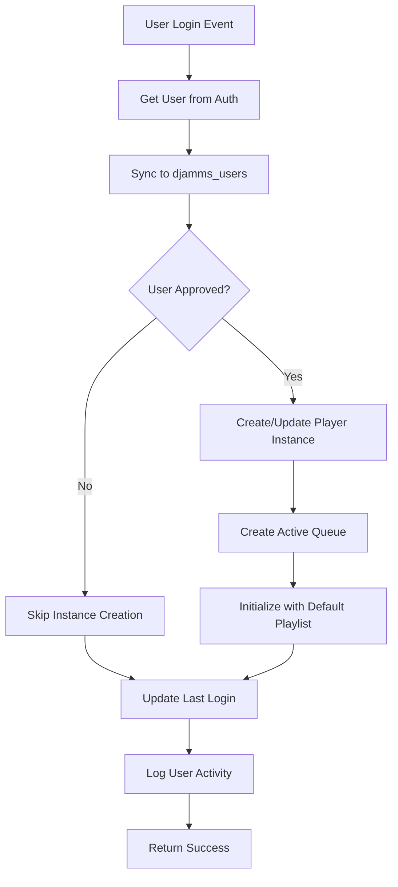

# DJAMMS Appwrite Functions

This directory contains server-side functions for DJAMMS that automatically handle user management and player instance creation using Appwrite's serverless functions.

## Overview

The functions implement server-side automation for:
- **Automatic user synchronization** from Appwrite Auth to DJAMMS database
- **Player instance auto-creation** for dev-approved users
- **Active queue initialization** with global default playlist
- **User activity logging** for analytics and debugging

## Functions

### 1. User Login Handler (`user-login-handler`)

**Trigger**: `users.*.sessions.*.create` (when user logs in)

**Purpose**: Automatically processes user logins by:
1. Syncing user data from Auth to `djamms_users` collection
2. Determining user role and approval status based on email
3. Creating player instances for dev-approved users
4. Initializing active queues with global default playlist
5. Logging user activity for analytics

**Runtime**: Node.js 18.0
**Timeout**: 30 seconds
**Event-driven**: Yes (webhook trigger)

## Project Structure

```
appwrite-functions/
├── deploy.sh                    # Deployment script
├── README.md                   # This file
└── user-login-handler/         # Login handler function
    ├── src/
    │   └── main.js             # Main function code
    ├── package.json            # Dependencies
    └── appwrite.json          # Function configuration
```

## Deployment

### Prerequisites

1. **Appwrite CLI installed**:
   ```bash
   npm install -g appwrite-cli
   ```

2. **Authenticated with Appwrite**:
   ```bash
   appwrite login
   ```

3. **Project initialized** (if not already done):
   ```bash
   appwrite init project
   ```

### Quick Deployment

Run the deployment script:
```bash
cd appwrite-functions
./deploy.sh
```

### Manual Deployment

1. **Navigate to function directory**:
   ```bash
   cd appwrite-functions/user-login-handler
   ```

2. **Create the function** (if it doesn't exist):
   ```bash
   appwrite functions create \
       --functionId "user-login-handler" \
       --name "DJAMMS User Login Handler" \
       --runtime "node-18.0" \
       --execute "any" \
       --events "users.*.sessions.*.create" \
       --timeout 30 \
       --enabled true \
       --logging true \
       --entrypoint "src/main.js" \
       --commands "npm install"
   ```

3. **Set environment variables**:
   ```bash
   appwrite functions updateVariables \
       --functionId "user-login-handler" \
       --variables "APPWRITE_DATABASE_ID=68cc92d30024e1b6eeb6,NODE_ENV=production"
   ```

4. **Deploy the code**:
   ```bash
   appwrite functions createDeployment \
       --functionId "user-login-handler" \
       --code . \
       --activate true
   ```

## Environment Variables

The functions require these environment variables:

| Variable | Description | Example |
|----------|-------------|---------|
| `APPWRITE_DATABASE_ID` | DJAMMS database ID | `68cc92d30024e1b6eeb6` |
| `NODE_ENV` | Environment mode | `production` |

**Auto-provided by Appwrite**:
- `APPWRITE_FUNCTION_ENDPOINT`
- `APPWRITE_FUNCTION_PROJECT_ID` 
- `APPWRITE_API_KEY`

## User Role Assignment

The function automatically assigns user roles based on email patterns:

### Admin Users
- `admin@djamms.app`
- `mike.clarkin@gmail.com`
- `admin@sysvir.com`

### Developer Users
- `demo@djamms.app`
- `dev@djamms.app`
- `test@djamms.app`

### Regular Users
- All other email addresses

**Note**: Only `admin` and `developer` roles get `devApproved: true` and automatic player instance creation.

## Function Flow

### User Login Handler Flow:



## Error Handling

The functions include comprehensive error handling:

- **Graceful degradation**: Login continues even if non-critical operations fail
- **Detailed logging**: All operations logged for debugging
- **Retry logic**: Built-in retry for transient failures
- **Fallback data**: Uses fallback playlists if default playlist missing

## Monitoring

### Function Logs
Check function execution logs in Appwrite Console:
1. Go to **Functions** → **user-login-handler**
2. Click **Logs** tab
3. Filter by date/time range

### Database Collections
Monitor the following collections for function activity:
- `djamms_users` - User synchronization
- `player_instances` - Player instance creation
- `active_queues` - Queue initialization
- `user_activity` - Activity logging

## Testing

### Test User Login Flow

1. **Create test user** in Appwrite Auth
2. **Login with test user** in DJAMMS frontend
3. **Check function logs** for execution
4. **Verify database** for created records

### Manual Function Trigger

You can manually trigger the function using Appwrite CLI:

```bash
appwrite functions createExecution \
    --functionId "user-login-handler" \
    --body '{"userId":"USER_ID_HERE"}' \
    --async false
```

## Troubleshooting

### Common Issues

1. **Function not triggering**:
   - Check event configuration: `users.*.sessions.*.create`
   - Verify function is enabled
   - Check webhook permissions

2. **Database permission errors**:
   - Ensure function has correct database permissions
   - Check `APPWRITE_API_KEY` has sufficient privileges

3. **User role not assigned correctly**:
   - Check email patterns in `determineUserRole()` function
   - Verify email case sensitivity

4. **Player instance creation fails**:
   - Check database collection exists: `player_instances`
   - Verify collection attributes are created
   - Check for duplicate instanceId values

### Debug Mode

Set `NODE_ENV=development` for detailed error messages in function responses.

## Security Considerations

- **Server-side validation**: All approval logic runs server-side
- **API key security**: Function API key has minimum required permissions
- **Input validation**: All user inputs validated before database operations
- **Error information**: Sensitive error details not exposed to client

## Performance

- **Async operations**: Non-blocking operations where possible
- **Timeout handling**: 30-second timeout prevents hanging
- **Resource optimization**: Minimal memory footprint
- **Database queries**: Optimized queries with proper indexing

## Contributing

When modifying functions:

1. **Test locally** using Appwrite Functions development mode
2. **Update documentation** if adding new features
3. **Follow error handling** patterns established
4. **Add logging** for new operations
5. **Test thoroughly** before deploying to production

## Support

For issues with Appwrite Functions:
- Check Appwrite Console logs
- Review function execution history
- Monitor database collection changes
- Contact DJAMMS development team